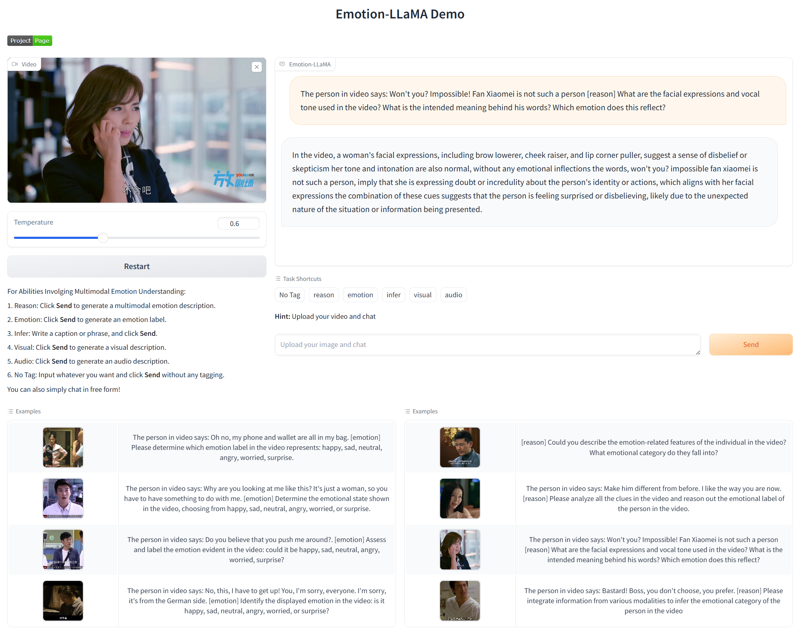
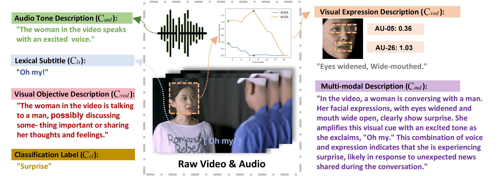

# Emotion-LLaMA: Multimodal Emotion Recognition and Reasoning with Instruction Tuning  

## Introduction  

Emotion perception is crucial in applications like human-computer interaction, education, and counseling. 
However, traditional single-modality approaches fall short in real-world scenarios with multimodal emotional data, and Multimodal Large Language Models (MLLMs) struggle with audio integration and recognizing facial micro-expressions. 
To address this, we introduce the MERR dataset, containing 28,618 coarse-grained and 4,487 fine-grained annotated samples across diverse emotional categories.
This dataset enables models to learn from varied scenarios and generalize to real-world applications.
Furthermore, we propose Emotion-LLaMA, a model that integrates audio, visual, and textual inputs through emotion-specific encoders.
By aligning features into a shared space and employing a modified LLaMA model with instruction tuning, Emotion-LLaMA enhances both emotional recognition and reasoning capabilities.
Extensive evaluations show Emotion-LLaMA outperforms other MLLMs, achieving top scores in Clue Overlap (7.83) and Label Overlap (6.25) on EMER, an F1 score of 0.9036 on MER2023 challenge, and the highest UAR (45.59) and WAR (59.37) in zero-shot evaluations on DFEW dataset.

## Demo



## MERR Dataset

### Comparison of Emotional Datasets
The MERR dataset extends the range of emotional categories and annotations beyond those found in existing datasets. Each sample is annotated with an emotion label and described in terms of its emotional expression. Download the annotation content of [the MERR dataset](https://drive.google.com/drive/folders/1LSYMq2G-TaLof5xppyXcIuWiSN0ODwqG?usp=sharing).


### Example of the MERR Dataset
The dataset was initially auto-annotated with coarse-grained labels for 28,618 samples from a large pool of unannotated data, and later refined to include 4,487 samples with fine-grained annotations. For more details on the data annotation process, see [MERR Dataset Construction](./MERR/README.md).




## Emotion-LLaMA


## Setup
### Prepare the code and the environment

```
git clone https://github.com/???/Emotion-LLaMA.git
cd Emotion-LLaMA
conda env create -f environment.yaml
conda activate llama
```

### Prepare the pretrained LLM weights
Download the Llama-2-7b-chat-hf model from Huggingface to "Emotion-LLaMA/checkpoints/"  
```
https://huggingface.co/meta-llama/Llama-2-7b-chat-hf
```
 
In the [model config file](minigpt4/configs/models/minigpt_v2.yaml#L14), specify the path to [Llama-2](https://huggingface.co/meta-llama/Llama-2-7b-chat-hf).
```
# set Llama-2-7b-chat-hf path
llama_model: "/home/user/project/Emotion-LLaMA/checkpoints/Llama-2-7b-chat-hf"
```


## Eval

### MER2023 Challenge

To further validate the effectiveness of the Emotion-LLaMA model, we conducted experiments using the MER2023 Challenge dataset and compared our results with previous state-of-the-art supervised methods. The outcomes show that our model, which maps audio and visual features to textual space, achieves the highest F1 score across various modalities. Our results can be replicated using the following steps.


In the [evaluation config file](eval_configs/eval_emotion.yaml#L8), specify the path to [pretrained checkpoint of Emotion-LLaMA](https://drive.google.com/drive/folders/1hD-d1Cu6r3nJBgUYLP30W3SJVpveoins?usp=sharing).  
```
# set pretrained checkpoint path
llama_model: "/home/user/project/Emotion-LLaMA/checkpoints/Llama-2-7b-chat-hf"
ckpt: "/home/user/project/Emotion-LLaMA/checkpoints/save_checkpoint/stage2/checkpoint_best.pth"
```

Run the following code to evaluate the F1 score on MER2023-SEMI:  
```
torchrun  --nproc_per_node 1 eval_emotion.py --cfg-path eval_configs/eval_emotion.yaml --dataset feature_face_caption
```


## Acknowledgement
- [MiniGPT-v2](https://arxiv.org/abs/2310.09478): Large Language Model as a Unified Interface for Vision-Language Multi-task Learning.
- [AffectGPT](https://arxiv.org/abs/2306.15401): Explainable Multimodal Emotion Recognition.
- [LLaVA](https://llava-vl.github.io/): Large Language-and-Vision Assistant.
