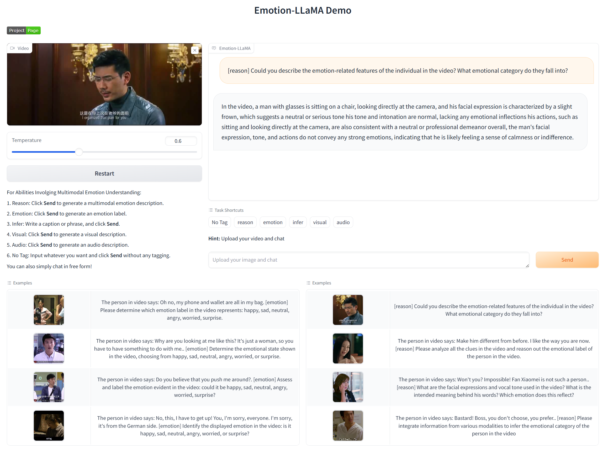
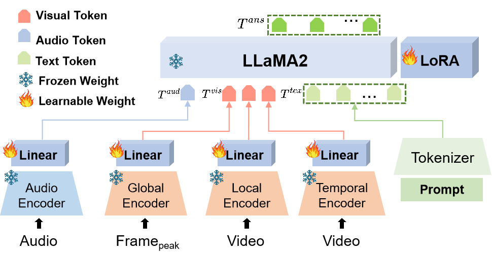
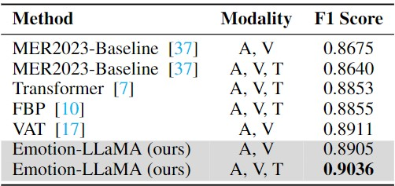

# Emotion-LLaMA: Multimodal Emotion Recognition and Reasoning with Instruction Tuning  

## 🚀 Overview

Accurate emotion perception is crucial for various applications, including human-computer interaction, education, and counseling. However, traditional single-modality approaches often fail to capture the complexity of real-world emotional expressions, which are inherently multimodal. Moreover, existing Multimodal Large Language Models (MLLMs) face challenges in integrating audio and recognizing subtle facial micro-expressions.

To address these issues, we introduce the **MERR dataset**, containing 28,618 coarse-grained and 4,487 fine-grained annotated samples across diverse emotional categories. This dataset enables models to learn from varied scenarios and generalize to real-world applications.

Additionally, we propose **Emotion-LLaMA**, a model that seamlessly integrates audio, visual, and textual inputs through emotion-specific encoders. By aligning features into a shared space and employing a modified LLaMA model with instruction tuning, Emotion-LLaMA significantly enhances both emotional recognition and reasoning capabilities.

Extensive evaluations demonstrate that Emotion-LLaMA outperforms other MLLMs, achieving top scores in Clue Overlap (7.83) and Label Overlap (6.25) on EMER, an F1 score of 0.9036 on the MER2023 challenge, and the highest UAR (45.59) and WAR (59.37) in zero-shot evaluations on the DFEW dataset.

Dive in to explore more about our innovative approach and impressive results!

## 🎬 Demo
You can experience the powerful emotion recognition capabilities of Emotion-LLaMA through the [online demo](https://huggingface.co/spaces/ZebangCheng/Emotion-LLaMA).




## 📊 MERR Dataset

### 📈 Comparison of Emotional Datasets

The MERR dataset extends the range of emotional categories and annotations beyond those found in existing datasets. Each sample is annotated with an emotion label and described in terms of its emotional expression. Download the annotation content of [the MERR dataset](https://drive.google.com/drive/folders/1LSYMq2G-TaLof5xppyXcIuWiSN0ODwqG?usp=sharing).


### 📝 Example of the MERR Dataset

The dataset was initially auto-annotated with coarse-grained labels for 28,618 samples from a large pool of unannotated data, and later refined to include 4,487 samples with fine-grained annotations. For more details on the data annotation process, see [MERR Dataset Construction](./MERR/README.md).


## 🧠 Emotion-LLaMA



## 🛠️ Setup

### Preparing the Code and Environment

```bash
git clone https://github.com/???/Emotion-LLaMA.git
cd Emotion-LLaMA
conda env create -f environment.yaml
conda activate llama
```

### Preparing the Pretrained LLM Weights

Download the Llama-2-7b-chat-hf model from Huggingface to `Emotion-LLaMA/checkpoints/`:

```
https://huggingface.co/meta-llama/Llama-2-7b-chat-hf
```

Specify the path to Llama-2 in the [model config file](minigpt4/configs/models/minigpt_v2.yaml#L14):

```yaml
# Set Llama-2-7b-chat-hf path
llama_model: "/home/user/project/Emotion-LLaMA/checkpoints/Llama-2-7b-chat-hf"
```

## 💡 Training
**1. Prepare Multi-modal Encoders**
To extract rich and comprehensive emotion features, we use the HuBERT model as the Audio Encoder, the EVA model as the Global Encoder, the MAE model as the Local Encoder, and the VideoMAE model as the Temporal Encoder. In practice, to save GPU memory, we do not load all Encoders directly onto the GPU but instead load the extracted features. Please modify the `get()` function in the [dataset file](minigpt4/datasets/datasets/first_face.py#L161) to set the path for reading the features.

**2. Prepare Multi-task Instruction**

First, set the type of tasks in the [dataset file](minigpt4/datasets/datasets/first_face.py#L61):
```python
self.task_pool = [
    "emotion",
    "reason",
]
```
Here, the "emotion" task represents a multi-modal emotion recognition task, while the "reason" task represents a multi-modal emotion inference task. Different tasks will randomly select different prompts from different instruction pools.

Then, concatenate the Features and Prompt according to the instruction template. The template is defined as follows:
```markdown
[INST] < AudioFeature > < VideoFeature > [Task Identifier] Prompt [/INST]
```

**3. Run**
Run the following code to pre-train Emotion-LLaMA:  
```bash
CUDA_VISIBLE_DEVICES=0,1,2,3 torchrun --nproc-per-node 4 train.py --cfg-path train_configs/Emotion-LLaMA_finetune.yaml
```

## 🧪 Evaluation

### MER2023 Challenge

To further validate the effectiveness of the Emotion-LLaMA model, we conducted experiments using the MER2023 Challenge dataset and compared our results with previous state-of-the-art supervised methods. The outcomes show that our model, which maps audio and visual features to textual space, achieves the highest F1 score across various modalities. Our results can be replicated using the following steps.



Specify the path to the pretrained checkpoint of Emotion-LLaMA in the [evaluation config file](eval_configs/eval_emotion.yaml#L8):

```yaml
# Set pretrained checkpoint path
llama_model: "/home/user/project/Emotion-LLaMA/checkpoints/Llama-2-7b-chat-hf"
ckpt: "/home/user/project/Emotion-LLaMA/checkpoints/save_checkpoint/stage2/checkpoint_best.pth"
```

Run the following code to evaluate the F1 score on MER2023-SEMI:

```bash
torchrun --nproc_per_node 1 eval_emotion.py --cfg-path eval_configs/eval_emotion.yaml --dataset feature_face_caption
```


## 🙏 Acknowledgements

- [MiniGPT-v2](https://arxiv.org/abs/2310.09478): Large Language Model as a Unified Interface for Vision-Language Multi-task Learning.
- [AffectGPT](https://arxiv.org/abs/2306.15401): Explainable Multimodal Emotion Recognition.
- [LLaVA](https://llava-vl.github.io/): Large Language-and-Vision Assistant.
